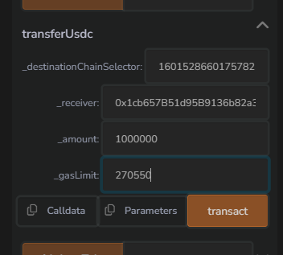

# Estimate_Gas_CCIP

This repository is the solution for the exercise given in [ChainLink Bootcamp Day-3](https://cll-devrel.gitbook.io/ccip-bootcamp/day-3/day-3-homework)

## Problem Statement

Following the [Optimizing gas](https://docs.chain.link/ccip/tutorials/ccipreceive-gaslimit) guide measure the gas consumption of the ccipReceive function. Once you have the number, increase it by 10% and provide as gasLimit parameter of the transferUsdc function instead of the currently hard-coded 500_000. Use [this](https://cll-devrel.gitbook.io/ccip-masterclass-4/ccip-masterclass/exercise-2-deposit-transferred-usdc-to-compound-v3#step-7-on-avalanchefuji-call-transferusdc-function) Gitbook for guidance.

## Solution

After the deployment of the desired contracts and following all those steps, we finally arrive to [Step 7](https://cll-devrel.gitbook.io/ccip-masterclass-4/ccip-masterclass/exercise-2-deposit-transferred-usdc-to-compound-v3#step-7-on-avalanchefuji-call-transferusdc-function) where we have to pass the estimated gaslimit instead of the hardcoded value of 500_000.

In order to reproduce the solution, we will be using Offchain method i.e. with the help of Tenderly. Here we go:

1. First, follow up these [prerequisites](https://docs.chain.link/ccip/tutorials/ccipreceive-gaslimit#prerequisites-2) that will help you set up the environment variables and generate the necessary typings.

2. I have already modified the `data.json` file and included addresses of both contracts i.e. `TransferUSDC.sol` as well as `CrossChainReciever.sol` which you can find in `contracts` directory.

3. Now we are all set to run `npm run estimate-gas-tenderly` command. Here's what I got after running this command:

    ```bash
    > estimate-gas-ccip@1.0.0 estimate-gas-tenderly D:\Stuff\chain\Chainlink\estimate-gas-ccip\offchain
    > ts-node src/estimateGasTenderly.ts

    Final Gas Usage Report:
    Number of iterations: 0 - Gas used: 226054
    Number of iterations: 50 - Gas used: 245954
    Number of iterations: 99 - Gas used: 245954
    ```

4. Now, we have to increase the gas limit by 10% of 245954 which is `270550` approximately. And, this value will be filled up as a parameter like this:

    

5. Here's the transaction hash -> `0x90f229fc151439527d5ad985f45240b9546561897b9ab63db668f1127950744d` which can be verified on [CCIP Explorer](https://ccip.chain.link/msg/0x200b0740742e8a26ddce3a3008343ac51c754daa900c078bed9527dda4c916ed).
